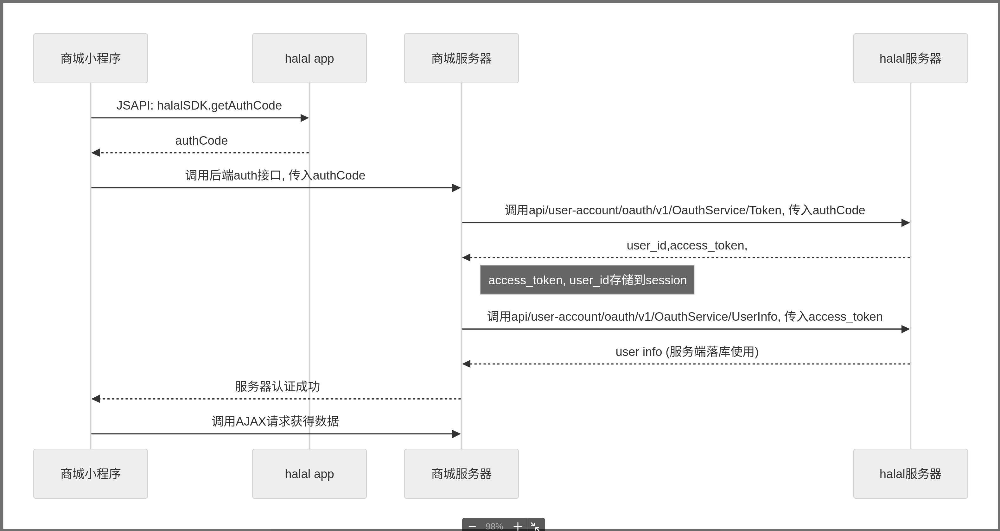

# halaplus 集成平台

欢迎使用 halaplus 集成平台！
## 📋 项目概述

halaplus 集成平台基于 OAuth 2.0 标准协议，采用最安全的授权码模式（Authorization Code Grant）并支持 PKCE 增强安全性。。

平台主要特性：
- 安全的 OAuth 2.0 授权码流程
- 支持 PKCE 安全增强机制
- 完整的令牌管理（获取、刷新、验证、撤销）
- 用户信息获取接口
- 严格的客户端身份验证

## 🚀 快速上手

### 1. 准备工作

在开始集成之前，您需要在 halaplus 开发者平台注册您的应用：

1. 访问开发者平台并创建新应用
2. 填写应用基本信息（名称、描述、图标等）
3. 设置回调地址（Redirect URI），必须与后台注册地址一致
4. 获取应用凭证：
   - Client ID（客户端ID）：应用的唯一标识
   - Client Secret（客户端密钥）：应用的密钥（请严格保密）
   
#### 测试环境信息

**测试应用凭证：**
为了方便开发测试，我们提供了测试账号和测试应用信息：
```json
client_id: test 
client_secret: test 
redirect_uri: http://localhost:8080
```
**测试APP下载：**
```json
https://fat-img.halaladmin.vip/pub/halal_develop_v1.0.0.19_202509131836_release.apk
```
**测试账号：**
- 账号1：test1@gmail.com / 密码：12345678
- 账号2：test2@gmail.com / 密码：12345678


### 2. 授权流程


整个授权流程分为三个核心步骤：

#### 步骤一：获取授权码（Authorization Code）

在您的客户端中引入 JSSDK 并调用授权方法：

```html
<script src="http://fat-img.halaladmin.vip/pub/halalsdk/halalSDK.min.js"></script>
window.halal.getAuthCode({ 
   responseType: "code", 
   clientId: "YOUR_CLIENT_ID", 
   redirectUri: "YOUR_REGISTERED_REDIRECT_URI", 
   scope: "profile", 
   state: "RANDOM_STRING" 
}).
then((response) =>{ 
    const { code } = response.data; 
    // 将 code 发送到您的服务器 
}).catch((error) => { 
    console.error("获取 authCode 失败:", error);
});
```

#### 步骤二：换取访问令牌（Access Token）

在您的服务器端使用 authCode 换取 Access Token：

```bash
curl -X POST 'https://fat-hapi.halaladmin.vip/api/user-account/oauth/v1/OauthService/Token' 
-H 'Content-Type: application/json' 
-d '{ 
   "grant_type":"authorization_code", 
   "client_id":"YOUR_CLIENT_ID", 
   "client_secret":"YOUR_CLIENT_SECRET", 
   "code":"AUTH_CODE_FROM_STEP_1", 
   "redirect_uri":"YOUR_REGISTERED_REDIRECT_URI" 
}'
```

### 3. 令牌管理

Access Token 会在 2 小时后过期，您可以使用 Refresh Token 获取新的访问令牌：

```bash
curl -X POST 'https://fat-hapi.halaladmin.vip/api/user-account/oauth/v1/OauthService/Token' 
-H 'Content-Type: application/json' 
-d '{ 
   "grant_type":"refresh_token", 
   "refresh_token":"REFRESH_TOKEN", 
   "client_id":"YOUR_CLIENT_ID", 
   "client_secret":"YOUR_CLIENT_SECRET" 
}'
```


## 📚 详细文档

有关详细的技术文档，请参阅 [OAuth2 接入文档](docs/oauth2.md)。

## 📞 技术支持

如有任何问题，请联系我们的技术支持团队。