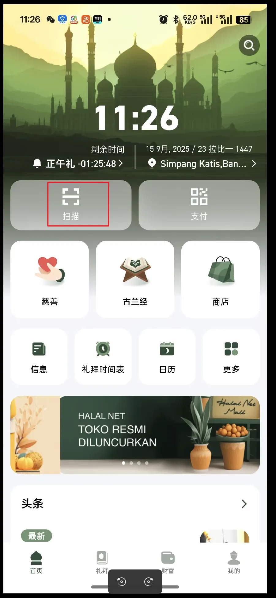
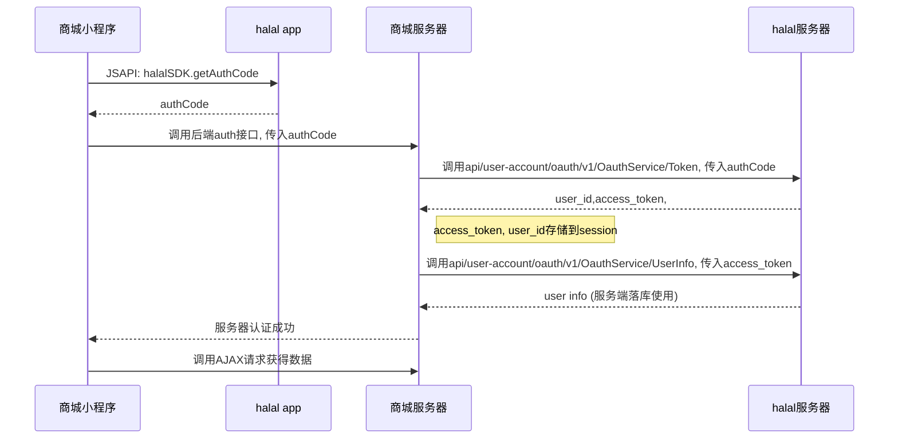

# halaplus 开发平台

# **[**halaplus**] OAuth 2.0 授权接入文档**

**版本:** 0.0.0.1

**最后更新日期:** 2025年9月11日

## 1. 简介

本文档旨在帮助第三方应用开发者集成 halaplus 的 OAuth 2.0 授权系统。通过本授权系统，您的应用可以在最终用户授权的情况下，安全地访问用户在 halaplus 平台上的指定数据。

我们采用 OAuth 2.0 协议中最常用、最安全的 **授权码模式 (Authorization Code Grant)**，并支持 **PKCE (Proof Key for Code Exchange)** 增强安全性。在整个流程中，您的应用都无法接触到用户的密码，有效保障了用户账号的安全。

## 2. 准备工作：创建应用

在开始集成之前，您需要先在 [你的服务名称] 开发者平台注册您的应用。

1. 访问我们的开发者平台：https://
2. 创建一个新的应用，并填写相关信息（如应用名称、描述、图标等）。
3. 设置回调地址 (Redirect URI)：这是授权流程中至关重要的一步。用户在授权后，我们会将用户重定向到您提供的这个地址。为安全起见，我们要求您**必须**在后台预先注册一个或多个固定的回调地址。
4. 创建成功后，您将获得以下两个关键凭证，请妥善保管：
    - **Client ID (客户端ID)**：应用的唯一标识，是对外公开的。
    - **Client Secret (客户端密钥)**：应用的密钥，**必须严格保密**，切勿泄露到客户端代码（如网页前端、App）中。


#### 测试环境信息
**测试应用凭证：**
```json
client_id: test 

client_secret: test 

redirect_uri: http://localhost:8080
```

**测试流程如下** :

1、下载halalplush app ,且登入

**测试APP下载：**
```json
https://fat-img.halaladmin.vip/pub/halal_develop_v1.0.0.19_202509131836_release.apk
```
**测试账号：**
- 账号1：test1@gmail.com / 密码：12345678
- 账号2：test2@gmail.com / 密码：12345678


2、使用app 扫码功能 扫描 你的网址二维码



3、app自动打开网页，执行js 获取 授权码 code


## **3. 授权流程详解**

整个授权流程分为三个核心步骤：获取授权码 code -> 换取访问令牌 access_token -> 调用API获取用户信息。



### **第一步：[客户端] 获取授权码 (Authorization Code)**

您的客户端（例如网页或小程序）需要调用我们的 JSSDK 来拉起授权流程，并获取一次性的 authCode。

### **1.1 引入 JSSDK**

在您的页面中引入我们的 JSSDK 文件：

```html
<!-- 推荐用于生产环境 -->
<script src="http://fat-img.halaladmin.vip/pub/halalsdk/halalSDK.min.js"></script>

<!-- 包含源码，用于开发调试 -->
<script src="http://fat-img.halaladmin.vip/pub/halalsdk/halalSDK.js"></script>
```

| **参数名** | **描述** |
| --- | --- |
| response_type | 必填 授权类型 固定值 code（授权码流程）  |
| client_id | 必填 客户端ID 上面创建应用获得 |
| redirect_uri | 选填 回调地址 上面创建应用填写 必须与注册时一致 |
| scope | 选填 授权范围 默认profile基本信息.目前只支持这个 |
| state | 选填 客户端随机字符串，用于防止 CSRF 攻击 |
| code_challenge | 选填 PKCE：SHA256 原始码 |
| code_challenge_method | 选填 固定 S256（推荐） |

**1.2 调用halal.getAuthCode方法**

```jsx
window.halal.getAuthCode({
    responseType: "code", // 必填，固定值
    clientId: "YOUR_CLIENT_ID", // 必填，您应用的 Client ID
    redirectUri: "YOUR_REGISTERED_REDIRECT_URI", // 选填，但建议填写，必须与后台注册的一致
    scope: "", // 选填，目前仅支持 'profile' 获取基本信息
    state: "", // 推荐，用于安全校验
    // --- PKCE 安全增强参数 (推荐) ---
    // codeChallenge: "GENERATED_CODE_CHALLENGE", 
    // codeChallengeMethod: "S256", 
})
.then((response) => {
    const { code } = response.data;
    console.log("getAuthCode成功", response);
    // 在这里将 code 发送到您的服务器
})
.catch((error) => {
    console.error("获取 authCode 失败:", error);
});
```

### **1.3 参数详解**

| **参数名** | **是否必须** | **描述** |
| --- | --- | --- |
| responseType | 是 | 授权类型，固定值为 code。 |
| clientId | 是 | 您在开发者平台获取的 Client ID。 |
| redirectUri | 否 | 回调地址。必须与您在开发者平台注册的地址完全一致。 |
| scope | 否 | 申请的权限范围，默认为 profile (基本信息)，目前仅支持此值。 |
| state | 推荐 | 一个随机生成的字符串，用于防止 CSRF 攻击。授权服务器会原样返回此参数。 |
| code_challenge | 推荐 | PKCE 流程中的挑战码，通过 code_verifier (原始码) SHA256 计算得出。 |
| code_challenge_method | 推荐 | PKCE 计算方法，固定值为 S256。 |

### **第二步：[服务器] 换取访问令牌 (Access Token)**

获取到 authCode 后，您的**服务器后端**需要立即向我们的令牌地址发起请求，以换取 Access Token。

**请求地址 (POST):** https://api.halalplus.com/api/user-account/oauth/v1/OauthService/Token

**Content-Type:** application/json

### **2.1 请求参数**

| **参数名** | **是否必须** | **描述** |
| --- | --- | --- |
| grant_type | 是 | 固定值为 authorization_code。 |
| client_id | 是 | 您的 Client ID。 |
| client_secret | 是 | 您的 Client Secret。 |
| code | 是 | 第一步中获取到的授权码 authCode。 |
| redirect_uri | 是 | 注册的回调地址 |
| code_verifier | 否 | 如果第一步中使用了 PKCE，此处必须传递 code_challenge 对应的原始码。 |

### **2.2 请求示例 (cURL)**

```bash
curl -X POST \
  'https://api.halalplus.com/api/user-account/oauth/v1/OauthService/Token' \
  -H 'Content-Type: application/json' \
  -d '{
    "grant_type":"authorization_code",
    "client_id":"test",
    "client_secret":"test",
    "code":"YZHMNDI2ODCTMJMWNI0ZNMI1LTLJYJQTN2VKYWVJY2I3N2FI",
    "redirect_uri":"https://fat-m.halaladmin.vip"
}'
```

### **2.3 成功响应**

```json
{
    "code": 200,
    "msg": "success",
    "data": {
        "access_token": "MGU4OWFLMJATYJAWMY0ZZGYWLTG0MDCTNZG4NZM1YTVJM2U0",
        "refresh_token": "MMY4YJNMYMUTNGNJOC01YJG4LWEWM2UTYJG4MTEWYJYWZGU5",
        "token_type": "Bearer",
        "expires_in": 7200,
        "user_id": "73"
    }
}
```

- access_token: 访问令牌，后续调用API时需要携带。**请妥善存储**。
- refresh_token: 用于刷新 Access Token 的令牌，有效期更长。**请务必安全存储**。
- expires_in: Access Token 的有效期（秒），例如7200秒代表2小时。
- user_id: 该令牌所属用户的唯一ID。

### **第三步：[服务器] 调用API获取用户信息**

获取 Access Token 后，您就可以调用我们受保护的API资源了。

**请求地址 (POST):** https://api.halalplus.com/api/user-account/oauth/v1/OauthService/UserInfo

### **3.1 请求方式**


| **参数名** | **是否必须** | **描述** |
| --- | --- | -- |
| access_token | 是 |  |

### **3.2 请求示例 (cURL)**

codeBash

```
curl -X POST \
  'https://api.halalplus.com/api/user-account/oauth/v1/OauthService/UserInfo' \
  -d '{
  "access_token":"NJVJMJA4MMETOGM5MY0ZMJIXLTGYY2ITOWQWYZE5MWVMZWU1"
  }'
```

### **3.3 成功响应**

codeJSON

```
{
    "code": 200,
    "msg": "success",
    "data": {
        "id": 73,
        "nickname": "test03",
        "avatar": "https://...",
        "gender": "FEMALE",
        "email": "test03@halalplus.com",
        "phone_num": "62811111111",
        "bind_email": true,
        "bind_phone": true,
        "has_password": true
    }
}
```

## 4. 令牌管理

### **4.1 刷新 Access Token**

Access Token 会在 expires_in 指定的时间后过期。过期后，您需要使用 Refresh Token 来获取一个新的 Access Token，而无需再次引导用户进行授权。

**请求地址 (POST):** https://api.halalplus.com/api/user-account/oauth/v1/OauthService/Token

**请求参数:**

- grant_type: 固定值为 refresh_token。
- refresh_token: 第二步中获取到的 refresh_token。
- client_id: 您的 Client ID。
- client_secret: 您的 Client Secret。

**响应:** 成功后响应体与第二步换取令牌时相同，会包含**新的** access_token 和 refresh_token。

### **4.2 验证 Access Token**

用于验证一个 Access Token 是否依然有效。

**请求地址 (POST):** https://api.halalplus.com/api/user-account/oauth/v1/OauthService/Verify

### **4.3 撤销 Access Token**

当用户在您的应用中退出登录时，建议调用此接口来使 Access Token 和 Refresh Token 失效。

**请求地址 (POST):** https://api.halalplus.com/api/user-account/oauth/v1/OauthService/Revoke

## 5. 附录：API接口地址汇总

- **[POST]** .../Token : 使用 authCode 或 refreshToken 获取令牌。
- **[POST]** .../UserInfo : 使用 accessToken 获取授权用户信息。
- **[POST]** .../Refresh : 刷新token
- **[POST]** .../Verify : 验证 accessToken 的有效性。
- **[POST]** .../Revoke : 撤销用户授权的令牌。

*（注：以上所有地址前缀为 https://api.halalplus.com/api/user/account/oauth/v1/OauthService）*

接口文档

https://fat-hdapi.halaladmin.vip/apiDoc/oauth-doc.html